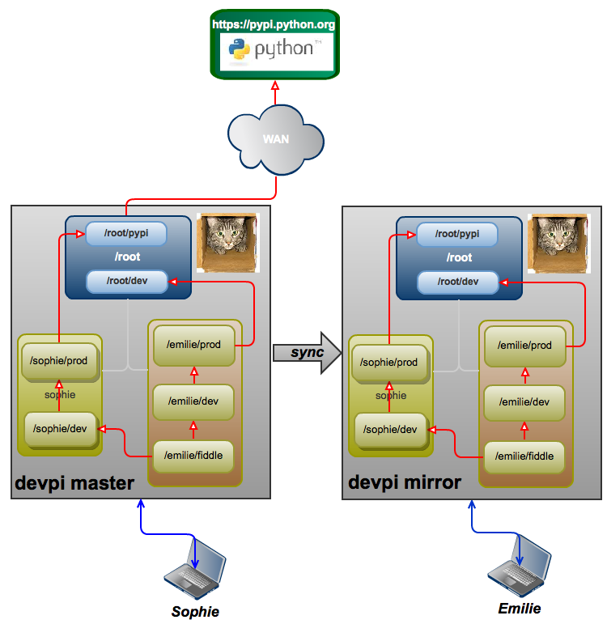

.. _devpi_um_indices_chapter:

Creating, configuring and using indices
=======================================

.. include:: ../links.rst

.. sidebar:: Summary
    
    This chapter covers index manipulation such as creation, deletion
    and use.
    
    :Pre-requisite: You must have logged in to a devpi server 
                    (see :ref:`devpi_um_authentication_chapter` for details)

.. _devpi_um_indices_use_section:

Overview
--------

In this chapter, we explore how we can create and modify indexes based according 
to the following structure:

with the two users already created.

"Use" sub-command
-----------------

When working with devpi, users need to make **use** of an index. The devpi 
client provides the :ref:`cmdref_use` sub-command to achieve this purpose::

   $ devpi use http://localhost:3141/
   using server: http://localhost:3141/ (logged in as root)
   no current index: type 'devpi use -l' to discover indices
   ~/.pydistutils.cfg     : http://localhost:4040/alice/dev/+simple/
   ~/.pip/pip.conf        : http://localhost:4040/alice/dev/+simple/
   ~/.buildout/default.cfg: http://localhost:4040/alice/dev/+simple/
   always-set-cfg: no
   
where ``http://devpi.mydomain:3141`` is the **base url** to a given `devpi`_ 
server. To use an index, users must specify an API endpoint defined as:

   current API endpoints to the ones obtained from the given url. If already 
   connected to a server, you can specify '/USER/INDEXNAME' which will use 
   the same server context. If you specify the root url you will not be 
   connected to a particular index.
   
To see the :ref:`um_concept_server_end_points`, login::

   $ devpi login emilie --password 1234
   logged in 'emilie', credentials valid for 10.00 hours
   
set the index::

   $ devpi use /root/pypi
   current devpi index: http://localhost:3141/root/pypi (logged in as emilie)
   ~/.pydistutils.cfg     : http://localhost:4040/alice/dev/+simple/
   ~/.pip/pip.conf        : http://localhost:4040/alice/dev/+simple/
   ~/.buildout/default.cfg: http://localhost:4040/alice/dev/+simple/
   always-set-cfg: no

and then issue::

   $ devpi use --urls
              index: http://localhost:3141/root/pypi
        simpleindex: http://localhost:3141/root/pypi/+simple/
         pypisubmit: None
              login: http://localhost:3141/+login
   ~/.pydistutils.cfg     : http://localhost:4040/alice/dev/+simple/
   ~/.pip/pip.conf        : http://localhost:4040/alice/dev/+simple/
   ~/.buildout/default.cfg: http://localhost:4040/alice/dev/+simple/
   always-set-cfg: no

.. addind a REsT comment here works around a regendoc bug.              
              
See :ref:`devpi_um_indices_list` for additional information on this command.

Creating an Index
-----------------

As explained in the previous chapter, once a new user is logged in, 
he or she doesn't have any index associated to his or her username::

   $ devpi use
   current devpi index: http://localhost:3141/root/pypi (logged in as emilie)
   ~/.pydistutils.cfg     : http://localhost:4040/alice/dev/+simple/
   ~/.pip/pip.conf        : http://localhost:4040/alice/dev/+simple/
   ~/.buildout/default.cfg: http://localhost:4040/alice/dev/+simple/
   always-set-cfg: no

In order to create an index, use the :ref:`cmdref_index` sub-command. In the 
example below, we create the **emilie/prod** production index::

   $ devpi index -c prod volatile=False
   http://localhost:3141/emilie/prod:
     type=stage
     bases=
     volatile=False
     acl_upload=emilie
     mirror_whitelist=
     pypi_whitelist=
   
which leads to the following::

   $ devpi getjson /emilie
   {
       "result": {
           "email": "emilienew@gmail.com", 
           "indexes": {
               "prod": {
                   "acl_upload": [
                       "emilie"
                   ], 
                   "bases": [], 
                   "mirror_whitelist": [], 
                   "pypi_whitelist": [], 
                   "type": "stage", 
                   "volatile": false
               }
           }, 
           "username": "emilie"
       }, 
       "type": "userconfig"
   }
   
Two things happened when issuing this command:

   * The index has no bases by default.
   * The index is created as :term:`non volatile index`
     (``volatile=False``) which is the desired result if the index is intended 
     to be a production index. 
     
Emilie can then create a development index (:term:`volatile index`) by 
specifying her ``prod`` index as follow::

   $ devpi index -c dev bases=/emilie/prod volatile=True
   http://localhost:3141/emilie/dev:
     type=stage
     bases=emilie/prod
     volatile=True
     acl_upload=emilie
     mirror_whitelist=
     pypi_whitelist=
   
which has the following definition on the server side::

   $ devpi getjson /emilie/dev
   {
       "result": {
           "acl_upload": [
               "emilie"
           ], 
           "bases": [
               "emilie/prod"
           ], 
           "mirror_whitelist": [], 
           "projects": [], 
           "pypi_whitelist": [], 
           "type": "stage", 
           "volatile": true
       }, 
       "type": "indexconfig"
   }

:note: While it is possible to create an infinity of indices for a user, 
       this number should to keep to a minimum. As explained in 
       :ref:`label_userman_concepts_chapter`, it is often preferable to modify 
       the bases of an existing index to say work on a package from another user 
       rather than creating a new one. 
       
       A typical use would be to have a user **production** index ``prod``  
       which contains package that are fully tested and eventually ready to 
       be released and a **development** or sandbox index ``dev`` which is 
       used to upload packages currently in the works.
       
Once her indexes are created::

   $ devpi index -l 
   emilie/prod
   emilie/dev

She can start using them (short endpoint)::

   $ devpi use dev
   current devpi index: http://localhost:3141/emilie/dev (logged in as emilie)
   ~/.pydistutils.cfg     : http://localhost:4040/alice/dev/+simple/
   ~/.pip/pip.conf        : http://localhost:4040/alice/dev/+simple/
   ~/.buildout/default.cfg: http://localhost:4040/alice/dev/+simple/
   always-set-cfg: no
   
or (long endpoint)::

   $ devpi use prod
   current devpi index: http://localhost:3141/emilie/prod (logged in as emilie)
   ~/.pydistutils.cfg     : http://localhost:4040/alice/dev/+simple/
   ~/.pip/pip.conf        : http://localhost:4040/alice/dev/+simple/
   ~/.buildout/default.cfg: http://localhost:4040/alice/dev/+simple/
   always-set-cfg: no
   
And from there, the urls should be set to:: 

   $ devpi use --urls
              index: http://localhost:3141/emilie/prod
        simpleindex: http://localhost:3141/emilie/prod/+simple/
         pypisubmit: http://localhost:3141/emilie/prod/
              login: http://localhost:3141/+login
   ~/.pydistutils.cfg     : http://localhost:4040/alice/dev/+simple/
   ~/.pip/pip.conf        : http://localhost:4040/alice/dev/+simple/
   ~/.buildout/default.cfg: http://localhost:4040/alice/dev/+simple/
   always-set-cfg: no
   
.. note:: By default, a user index has its ``acl_upload`` property set to 
          himself/herself. This implies that other users are not allowed 
          to upload packages in that index.  

.. _mirror_index:

Creating a mirror index
^^^^^^^^^^^^^^^^^^^^^^^

.. versionadded:: 3.0

A mirroring index can be created by using ``type=mirror`` and setting the
``mirror_url`` option::

   $ devpi index -c pypi type=mirror mirror_url=https://pypi.python.org/simple/
   http://localhost:3141/emilie/pypi:
     type=mirror
     bases=
     volatile=True
     acl_upload=
     mirror_url=https://pypi.python.org/simple/
     pypi_whitelist=

Additionally you can set ``mirror_web_url_fmt`` if you want links to the
original mirror in the web interface. For *root/pypi* the default
for ``mirror_web_url_fmt`` is ``https://pypi.python.org/pypi/{name}``. That is
a Python format string, so the ``{name}`` part is replaced by the project name.

.. _devpi_um_indices_modify:
   
Modifying an Index
------------------

It is possible to modify an index. This should be used to change the index's bases,
:term:`acl` modification and for changing its volatility.

Changing the Bases
^^^^^^^^^^^^^^^^^^

Assuming that Sophie has both index types as well::

   $ devpi login sophie --password=1234
   logged in 'sophie', credentials valid for 10.00 hours
   
::

   $ devpi index -c prod volatile=False
   http://localhost:3141/sophie/prod:
     type=stage
     bases=
     volatile=False
     acl_upload=sophie
     mirror_whitelist=
     pypi_whitelist=
   
::

   $ devpi index -c dev bases=/sophie/prod volatile=True
   http://localhost:3141/sophie/dev:
     type=stage
     bases=sophie/prod
     volatile=True
     acl_upload=sophie
     mirror_whitelist=
     pypi_whitelist=

Lets now assume that Sophie uploads her ``pysober`` package in her **dev** 
index and Emilie wants to test the integration of this package with the 
package she is currently working on.

.. note:: See :ref:`devpi_um_indices_list` to see how indexes on the server 
          can be listed.  
   
One easy way to achieve this is by modifying the ``/emilie/dev`` index's 
bases::

   $devpi login emilie --password=1234
   logged in 'emilie', credentials valid for 10.00 hours

::

   $ devpi index /emilie/dev bases=/emilie/prod,/sophie/dev
   /emilie/dev changing bases: ['/emilie/prod', '/sophie/dev']
   http://localhost:3141/emilie/dev:
     type=stage
     bases=emilie/prod,sophie/dev
     volatile=True
     acl_upload=emilie
     mirror_whitelist=
     pypi_whitelist=
   
.. note:: It is important to specify all bases for that index, that is repeating
          **/emilie/prod** which can be obtained by doing::
       
          $ devpi index /emilie/dev
          
From there, Emilie can install ``pysober`` by refering to her own index alone.  
When the work is done, this relationship can be revoked by doing::
   
   $ devpi index /emilie/dev bases=/emilie/prod
   /emilie/dev changing bases: ['/emilie/prod']
   http://localhost:3141/emilie/dev:
     type=stage
     bases=emilie/prod
     volatile=True
     acl_upload=emilie
     mirror_whitelist=
     pypi_whitelist=

.. Adding a comment to work around a bug in regendoc where all lines are removed.     
     
which now has the ``/emilie/dev`` as a base only::
   
   $ devpi index /emilie/dev
   http://localhost:3141/emilie/dev:
     type=stage
     bases=emilie/prod
     volatile=True
     acl_upload=emilie
     mirror_whitelist=
     pypi_whitelist=
   
Modifying the ACL
^^^^^^^^^^^^^^^^^

To modify the ACLs, you have to set the whole list of allowed users.
Emilie may allow sophie to upload to her dev index:

.. code-block:: console

   $ devpi index /emilie/dev acl_upload=emilie,sophie
   /emilie/dev changing acl_upload: ['emilie', 'sophie']
   http://localhost:3141/emilie/dev:
     type=stage
     bases=emilie/prod
     volatile=True
     acl_upload=emilie,sophie
     mirror_whitelist=
     pypi_whitelist=

If you have a plugin implementing an authentication method with group support,
then you can use them in acls by prefixing the group name with a colon.
Suppose you want to allow all users in the "developers" group to upload packages:

.. code-block:: console

   $ devpi index /emilie/dev acl_upload=emilie,:developers
   /emilie/dev changing acl_upload: ['emilie', ':developers']
   http://localhost:3141/emilie/dev:
     type=stage
     bases=emilie/prod
     volatile=True
     acl_upload=emilie,:developers
     mirror_whitelist=
     pypi_whitelist=

It is also possible to allow anonymous uploads if you have a controlled environment.

.. code-block:: console

   $ devpi index /emilie/dev acl_upload=:ANONYMOUS:
   /emilie/dev changing acl_upload: [':ANONYMOUS:']
   http://localhost:3141/emilie/dev:
     type=stage
     bases=emilie/prod
     volatile=True
     acl_upload=:ANONYMOUS:
     mirror_whitelist=
     pypi_whitelist=

Modifying the mirror whitelist
^^^^^^^^^^^^^^^^^^^^^^^^^^^^^^

The mirror whitelist prevents malicious uploads from PyPI to be mixed in with your private packages.

To allow uploads on PyPI or another mirror to be visible on your index, you have to add the project to the whitelist.

.. code-block:: console

   $ devpi index -c someindex mirror_whitelist=mypkg
   http://localhost:3141/emilie/someindex:
     type=stage
     bases=
     volatile=True
     acl_upload=emilie
     mirror_whitelist=mypkg
     pypi_whitelist=

You can also whitelist all packages on an index by setting mirror_whitelist to an asterisk.

.. code-block:: console

   $ devpi index -c wheelindex mirror_whitelist="*"
   http://localhost:3141/emilie/wheelindex:
     type=stage
     bases=
     volatile=True
     acl_upload=emilie
     mirror_whitelist=*
     pypi_whitelist=

Modifying the title and description
^^^^^^^^^^^^^^^^^^^^^^^^^^^^^^^^^^^

.. versionadded:: 3.0

An index can have a title and description which is used in ``devpi-web``.

.. code-block:: console

   $ devpi index -c wheelindex "title=Wheel Index" "description=Used for pip wheels"
   http://localhost:3141/emilie/wheelindex:
     type=stage
     bases=
     volatile=True
     acl_upload=emilie
     mirror_whitelist=*
     pypi_whitelist=
     title=Wheel Index
     description=Used for pip wheels

The description is included as is on the index overview page. You can't use any
html here for security reasons.

Switching Between Indices
-------------------------

Now that we have two indices, we can switch between them by doing::

   $ devpi use /emilie/prod
   current devpi index: http://localhost:3141/emilie/prod (logged in as emilie)
   ~/.pydistutils.cfg     : http://localhost:4040/alice/dev/+simple/
   ~/.pip/pip.conf        : http://localhost:4040/alice/dev/+simple/
   ~/.buildout/default.cfg: http://localhost:4040/alice/dev/+simple/
   always-set-cfg: no

checking::

   $ devpi use 
   current devpi index: http://localhost:3141/emilie/prod (logged in as emilie)
   ~/.pydistutils.cfg     : http://localhost:4040/alice/dev/+simple/
   ~/.pip/pip.conf        : http://localhost:4040/alice/dev/+simple/
   ~/.buildout/default.cfg: http://localhost:4040/alice/dev/+simple/
   always-set-cfg: no

switching::

   $ devpi use /emilie/dev
   current devpi index: http://localhost:3141/emilie/dev (logged in as emilie)
   ~/.pydistutils.cfg     : http://localhost:4040/alice/dev/+simple/
   ~/.pip/pip.conf        : http://localhost:4040/alice/dev/+simple/
   ~/.buildout/default.cfg: http://localhost:4040/alice/dev/+simple/
   always-set-cfg: no

and checking again::

   $ devpi use
   current devpi index: http://localhost:3141/emilie/dev (logged in as emilie)
   ~/.pydistutils.cfg     : http://localhost:4040/alice/dev/+simple/
   ~/.pip/pip.conf        : http://localhost:4040/alice/dev/+simple/
   ~/.buildout/default.cfg: http://localhost:4040/alice/dev/+simple/
   always-set-cfg: no

Deleting an Index
-----------------

:attention: Proceed with care as deleting an index can not be undone. 

In the example below, we create a "bad" index and delete it::

   $ devpi index -c oups bases=/emilie/prod volatile=True
   http://localhost:3141/emilie/oups:
     type=stage
     bases=emilie/prod
     volatile=True
     acl_upload=emilie
     mirror_whitelist=
     pypi_whitelist=

here is the bad index::

   $ devpi getjson /emilie/oups
   {
       "result": {
           "acl_upload": [
               "emilie"
           ], 
           "bases": [
               "emilie/prod"
           ], 
           "mirror_whitelist": [], 
           "projects": [], 
           "pypi_whitelist": [], 
           "type": "stage", 
           "volatile": true
       }, 
       "type": "indexconfig"
   }
 
which is now deleted::  

   $ devpi index -y --delete /emilie/oups
   About to remove: <URL 'http://localhost:3141/emilie/oups'>
   Are you sure (yes/no)? yes (autoset from -y option)
   index deleted: <URL 'http://localhost:3141/emilie/oups'>
   
And to prove it::

   $ devpi getjson /emilie/oups
   GET http://localhost:3141/emilie/oups
   404 Not Found: The stage emilie/oups could not be found.
   
.. _devpi_um_indices_list:   
   
Listing indexes
---------------

The **devpi** :ref:`cmdref_index` command show the existing indexes for a
given user::

   $ devpi index -l
   emilie/prod
   emilie/pypi
   emilie/someindex
   emilie/dev
   emilie/wheelindex
   
However, it is sometimes useful to see all indexes present on the server. This 
can done with the **devpi** :ref:`cmdref_use` ``-l`` command [#f1]_ which 
provides, not only the index names and their owner, but also index property
information::

   $ devpi use -l
   sophie/prod     bases=                volatile=False
   sophie/dev      bases=sophie/prod     volatile=True
   root/pypi       bases=                volatile=False
   emilie/prod     bases=                volatile=False
   emilie/pypi     bases=                volatile=True
   emilie/someindex bases=                volatile=True
   emilie/dev      bases=emilie/prod     volatile=True
   emilie/wheelindex bases=                volatile=True

.. rubric:: Footnotes

.. [#f1] At the present time, it is not possible to issue ``devpi use -l <username>``
         see `feature request #38 <https://bitbucket.org/hpk42/devpi/issue/38/>`_

   

