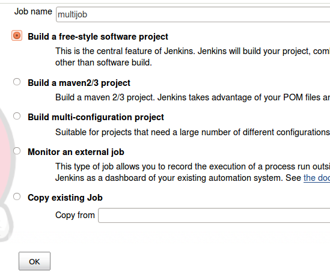
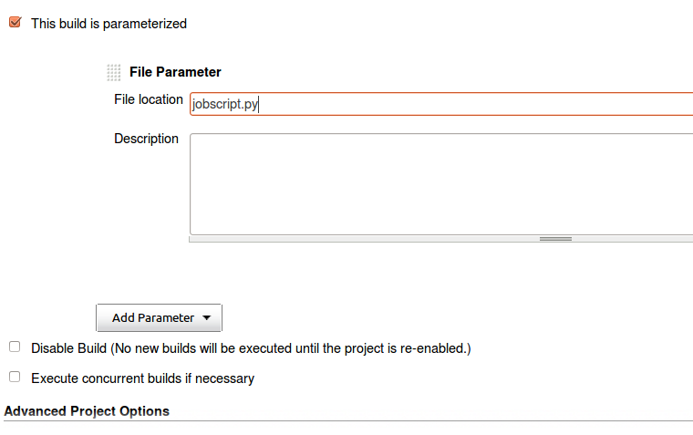
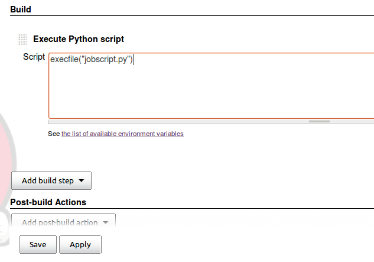

.. _label_userman_devpi_miscellaneous_chapter:

Miscellaneous
=============

.. include:: ../links.rst

.. sidebar:: Summary

    Placeholder for miscellaneous information such a debugging techniques, tricks, and perhaps FAQ.

.. _`jenkins integration`:

Configuring Jenkins integration
-------------------------------

devpi-server can trigger Jenkins to test uploaded packages using tox_.
This needs configuration on two sides:

- devpi: configuring an index to send POST requests to Jenkins upon upload

- Jenkins: adding one or more jobs which can get triggered by devpi-server.

Configuring a devpi index to trigger Jenkins
++++++++++++++++++++++++++++++++++++++++++++

Here is a example command, using a ``/testuser/dev`` index
and a Jenkins server at http://localhost:8080::

    # needs one Jenkins job for each name of uploaded packages
    devpi index /testuser/dev uploadtrigger_jenkins=http://localhost:8080/job/{pkgname}/build

Any package which gets uploaded to ``/testuser/dev`` will now trigger
a POST request to the specified url.  The ``{pkgname}`` part will be substituted with the name of the uploaded package.  You don't need to specify such
a substitution, however, if you rather want to have one generic Jenkins
job which executes all tests for all your uploads::

    # one generic job for all uploaded packages
    devpi index /testuser/dev uploadtrigger_jenkins=http://localhost:8080/job/multijob/build

This requires a single ``multijob`` on the Jenkins side whereas the prior
configuration would require a job for each package name that you possibly
upload.

Note that uploading a package will succeed independently if a build job could
be submitted successfully to Jenkins.

Configuring Jenkins job(s)
++++++++++++++++++++++++++

On the Jenkins side, you need to configure one or more jobs which can
be triggered by devpi-server.  Each job is configured in the same way:

- go to main Jenkins screen

- hit "New Job" and enter a name ("multijob" if you want to configure
  a generic job), then select "freey style software project", hit OK.

- enable "This build is parametrized" and add a "File Parameter",
  setting the file location to ``jobscript.py``.

- add a buildstep "Execute Python script" (you need to have the Python
  plugin installed and enabled in Jenkins) and enter
  ``execfile("jobscript.py")``.

- hit "Save" for the new build job.

You can now ``devpi upload`` a package to an index and see Jenkins starting
after the upload successfully returns.

Behind the scenes
+++++++++++++++++

Once you triggered a job from devpi, you can checkout the ``jobscript.py``
in the Jenkins workspace to see what was injected.  The injected
script roughly follows these steps:

- retrieves a stable virtualenv release through the devpi root/pypi
  index (i.e. use its caching ability)

- unpack the virtualenv tar ball and run the contained "virtualenv.py"
  script to create a ``_devpi`` environment

- install/upgrade ``devpi-client`` into that environment

- ``devpi use`` the index which we were triggered from

- ``devpi test PKG`` where PKG is the package name that we uploaded.

Uploading Sphinx docs
---------------------

If you have `Sphinx-based documentation <http://sphinx-doc.org/>`_ you can
upload the rendered HTML documentation to your devpi server with the following
command::

    devpi upload --with-docs

This will build and upload Sphinx documentation by configuring and running
this command::

    setup.py build_sphinx -E --build-dir $BUILD_DIR \
             upload_docs --upload-dir $BUILD_DIR/html

If you have distutils configured to use a devpi index you can upload
documentation to that index simply by executing::

    python setup.py upload_docs

Once uploaded the documentation will be linked to from the index overview page.
Documentation URLs have the following form::

    http://$DEVPI_URL/$USER/$INDEX/$PACKAGE/$VERSION/+doc/index.html

The ``devpi upload --with-docs`` command may fail with the following error::

    error: invalid command 'build_sphinx'

This probably means you're using an old version of setuptools that doesn't
support the `build_sphinx` command used by devpi, so you need to update
setuptools::

    pip install -U setuptools

If the ``devpi upload --with-docs`` command still fails with the same error
message, maybe you forgot to install Sphinx? In that case::

    pip install sphinx

Bulk uploading release files
----------------------------

If you have a directory with existing package files::

    devpi upload --from-dir PATH/TO/DIR

will recursively collect all archives files, register
and upload them to our local ``testuser/dev`` pypi index.

.. _`configure pypirc`:

Using plain ``setup.py`` for uploading
--------------------------------------

In order for ``setup.py`` to register releases and upload
release files we need to configure our index server in
the ``$HOME/.pypirc`` file::

    # content of $HOME/.pypirc
    [distutils]
    index-servers = ...  # any other index servers you have
        dev

    [dev]
    repository: http://localhost:3141/testuser/dev/
    username: testuser
    password: <YOURPASSWORD>

Now let's go to one of your ``setup.py`` based projects and issue::

    python setup.py sdist upload -r dev

This will upload your ``sdist`` package to the ``testuser/dev`` index,
configured in the ``.pypirc`` file.

If you now use ``testuser/dev`` for installation like this::

    pip install -i http://localhost:3141/testuser/dev/+simple/ PKGNAME

You will install your package including any pypi-dependencies
it might need, because the ``testuser/dev`` index inherits all
packages from the pypi-mirroring ``root/pypi`` index.

.. note::

    If working with multiple indices, it is usually more
    convenient to use :ref:`devpi upload`.
