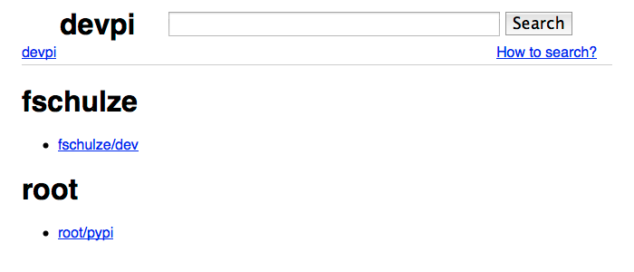
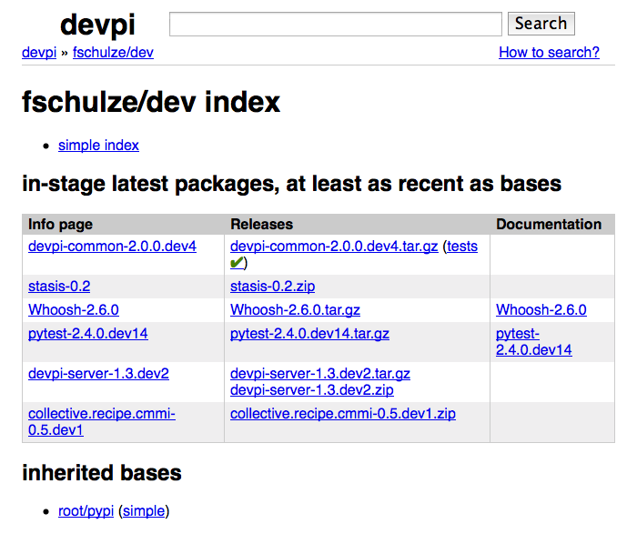
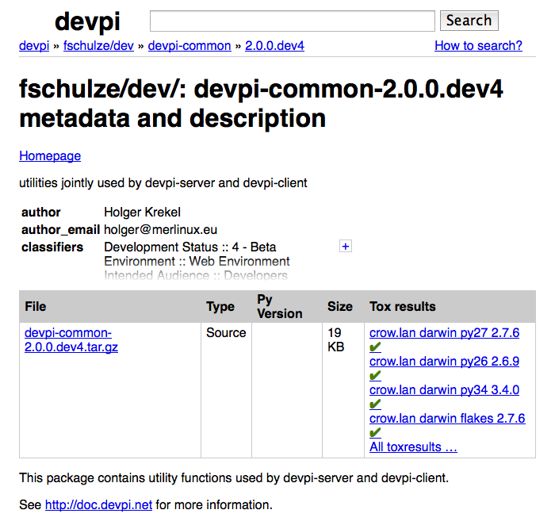
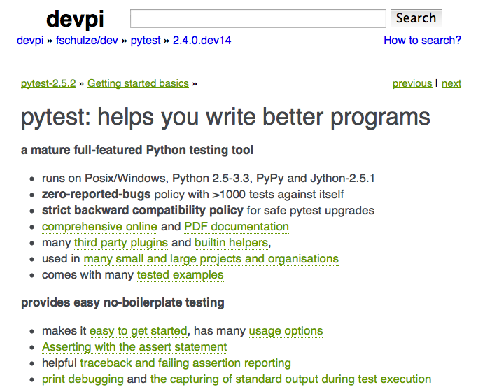

Web interface and search
============================

.. versionadded:: 2.0

The web interface is distributed as a `separate devpi-web package <https://pypi.python.org/pypi/devpi-web>`_ which needs to be installed alongside the
``devpi-server`` package ahead of the first server start.  ``devpi-web`` 
provides navigation and search facilities as well as access to uploaded
documentation and tox based testing results for release files.  Without 
``devpi-web``, the core ``devpi-server`` is fully functional for tool usage
but the web interface will otherwise just display json-type information 
on most urls.

.. note::

    If you have a :doc:`replica` setup you are free to run only a replica
    site with the web interface and run a core ``devpi-server`` without it.

    Note, however, that as of the 2.0 version, you cannot add the web interface
    plugin after the first devpi-server start.  It's recommended to
    install the web interface for devpi-server installations unless you are
    aiming for a more refined deployment aiming at minimizing risks.
    It's fine to uninstall devpi-web later in the lifetime of a devpi-server.

    It is possible to use devpi-web if you run an import though. So if you
    already used devpi-server and want to start using devpi-web, you can do so
    by exporting your data and importing it in an installation that has
    devpi-web included.

Usage and installation
-------------------------------------------

``devpi-web`` needs to be installed alongside ``devpi-server`` before
the server is started the first time because it needs to follow all 
server state changes from the beginning. You can export without devpi-web
and import in a new installation with devpi-web though.

You can install the web interface with::

    pip install devpi-web

There is no configuration needed as ``devpi-server`` will automatically
discover the web plugin through calling :doc:`hooks` using the setuptools
entry points mechanism.

Navigation (commented screenshots)
----------------------------------------------------

At the root of your devpi server web interface you get an overview of the existing users and their indices:

The index view shows the latest uploads with their info.
You get links to test results and documentation:

The version view shows you all the details about a certain version. It links the homepage, documentation and tox results:

At the top you get links to the index, the package and the version you are currently in.

You can also show package documentation which is embedded into the navigation:

Searching metadata and documentation
----------------------------------------------------

With the search at the top you can search packages in various ways.
The detailed help is included in the "How to search?" link in the top right.

Some examples for searches:

 - `pytest` searches everything for pytest
 - `pytest type:page` searches only in documentation pages but in all uploaded documentation
 - `ValueError name:pytest` searches for 'ValueError' in all data and documentation we have on projects named 'pytest'.
 - `name:devpi* path:/fschulze/*` search for packages starting with devpi in anything uploaded by 'fschulze'.
 - `classifiers:'Programming Language :: Python :: 3'` searches for packages with the specified classifier, note the single quotes around the classifier, they are necessary because of the whitespace.
